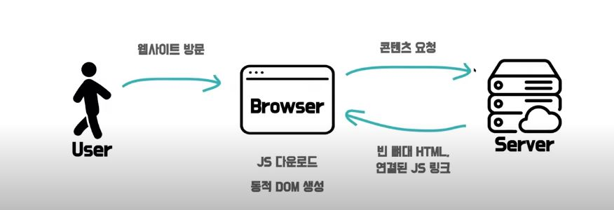
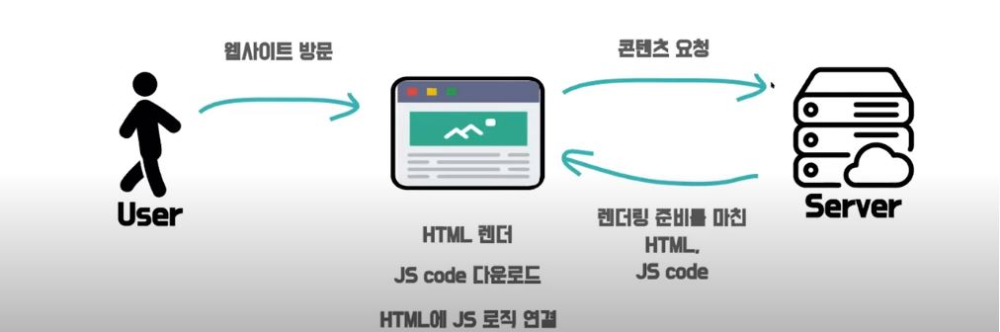

### SPA(Single Page Application)

* 한 개의 페이지로 이루어진 어플리케이션

### MPA(Multi Page Application)

* 탭을 이동할 때 마다 서버로부터 새로운 HTML을 새로 받아와 페이지 전체를 새로 렌더링 하는 전통적인 구성 방식
* 페이지 전환 시 마다 화면이 깜빡임

```
SPA -> CSR
MPA -> SSR
주로 위와 같이 사용이 되나,

SPA !== CSR
MPA !== SSR
서로 절대 같은 개념은 아니니 유의할 것!
페이지의 갯수와 렌더링을 어디서 하냐에 따라 달라질 수 있음
```

<br>

### CSR(Client Side Rendering)

* 클라이언트 측에서 렌더링 하는 방식
* react, vue, Angular...



* CSR은 브라우저가 JS 파일을 다운로드 받고 동적으로 DOM을 생성하는 시간을 기다려야 함으로 초기 로딩 속도가 느림.
* 초기 로딩 이후 페이지 일부를 변경할 땐 서버에 해당 데이터만 요청하면 되므로 이후 구동 속도는 빠름
* 서버는 빈 뼈대만 전달해 주면 되므로 서버측의 부하가 적음
* 클라이언트측에서 연산, 라우팅을 처리하므로 반응속도가 빠르고 UX도 우수함
* 그러나 SEO에 불리한 점이 있음

<br>

### SSR(Server Side Rendering)

* 서버 측에서 렌더링 하는 방식
* 요청시 서버에서 즉시 HTML 을 만들어서 응답함(미리 만들어두기 어려운 페이지에 적합)
* php, java...



* 모든 데이터가 이미 HTML에 담겨진 채로 브라우저에 전송되기 때문에 SEO 최적화에 유리함
* Javascript 코드를 다운로드 받고 실행하기 전에 사용자가 화면을 미리 볼 수 있음 (초기 구동 속도 빠름)
* 그러나 클라이언트측 JS가 실행되고 이벤트 핸들러가 첨부되서 JS 로직이 모두 연결될 때까지 사용자에 입력에 응답할 수 없음 (TTV[Time To View] !== TTI[Time To Interact])

<br>

### SSG (Static Site Generation) / (Static Rendering)

* 서버에서 HTML을 보내준다는 개념은 SSR 과 비슷하나 언제 만들어졌는가 에 차이가 있음
* 미리 다 만들어 두므로 바뀔 일이 거의 없는 페이지에 적합

<br>

### 장/단점?

#### CSR
+ 장점
  - 화면 깜빡임이 없음
  - 초기 로딩 이후 구동 속도가 빠름
  - TTV와 TTI 사이 간극이 없음
  - 서버 부하 분산

<br>

+ 단점
  - 초기 로딩 속도가 느림
  - SEO에 불리함

#### SSR
+ 장점
  - 초기 구동 속도가 빠름
  - SEO에 유리함

<br>

+ 단점
  - 화면 깜빡임이 있음
  - TTV와 TTI 사이 간극이 있음
  - 서버 부하가 있음

<br>

### CSR의 단점 보완 방법?

#### 초기 로딩 속도 보완?
```
1. code splitting
2. tree-shaking
3. chuck 분리
4. SSR, SSG 도입
```

#### SEO 개선?
```
1. pre-rendering
2. SSR, SSG 도입
```

### CSR + SSG/SSR?
```
1. 프레임워크 없이 도입하는 방법
  - express.js 로 별도의 서버를 직접 운영
  - typescript 설정이 걱정되면 nest.js 를 활용

2. SSG/SSR 을 도입할 수 있는 프레임워크 활용
  - Next.js - 페이지별로 SSR, SSG 선택 가능
  - Gatsby.js - SSG에 최적화, 다양한 플러그인
  - Nuxt.js - vue.js 기반 프레임워크
  - Universal - Angular4부터 코어 모듈에 포함
  - CSR에 비해 코드 복잡도는 높을 수 있음, 블랙박스 영역 존재

  ? 블랙박스 -> 직접 제어하기 어려운 영역
```

### CSR + SSR?
```
Isomorphic App
Universal Rendering

1. 초기 로딩 속도 보완
2. SEO 개선
3. CSR의 장점
```

### 궁극적으로 무엇을 써야 할까?
```
서비스 성격에 따라 다름.

유저랑 상호 작용이 많음, 검색 엔진에 노출 될 필요는 없음? -> CSR

회사 홈페이지(상위에 노출되어야 함), 누구에게나 항상 같은 내용, 매주 업데이트가 됨 -> SSR

회사 홈페이지(상위에 노출되어야 함), 누구에게나 항상 같은 내용, 업데이트를 거의 안함 -> SSG

사용자에 따라 페이지 내용이 달라짐, 빠른 인터랙션, 검색 엔진 상위 노출 -> CSR + SSR(Universal Rendering)
```

<br>
<br>

# Refer
우아한테크 [10분 테코톡] 신세한탄의 CSR&SSR - https://youtu.be/YuqB8D6eCKE


