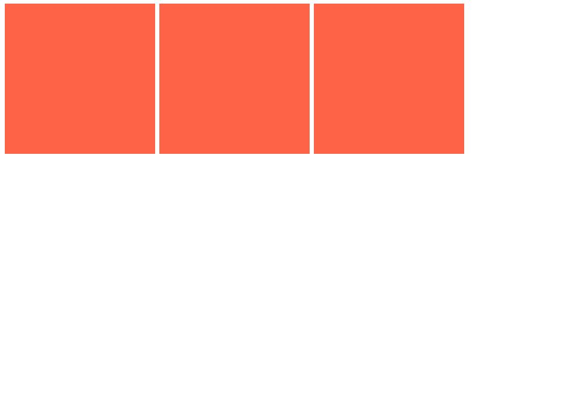
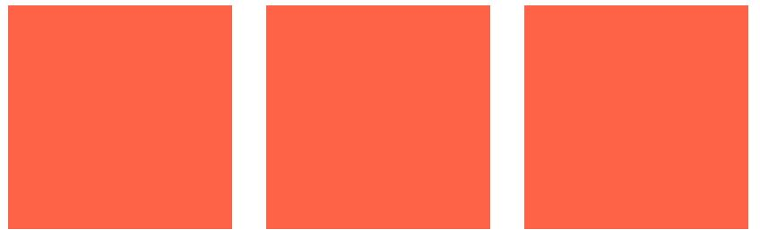
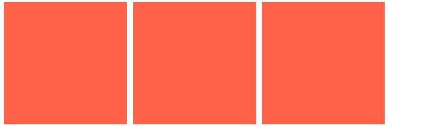
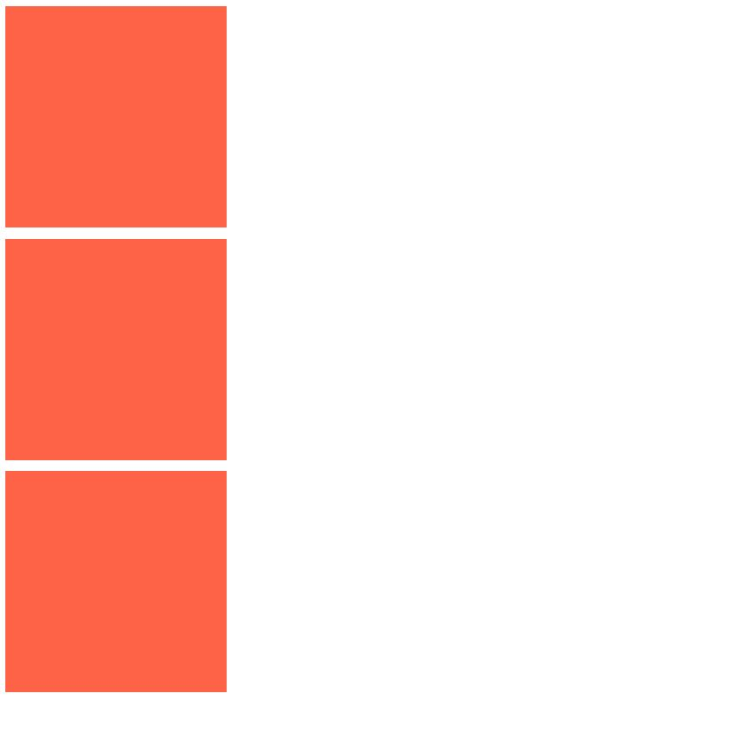
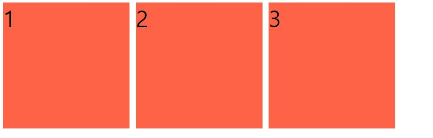
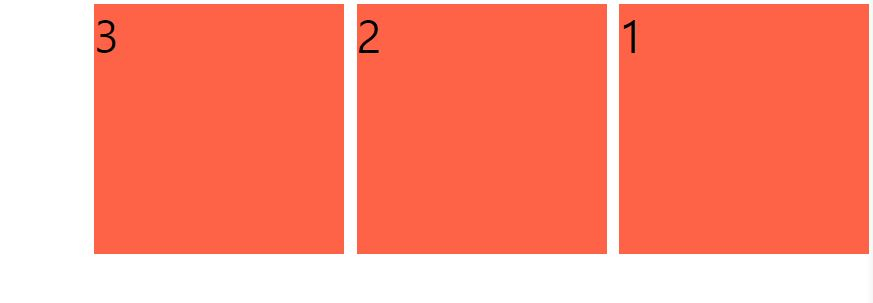

## Flexbox 이전의 HTML 요소의 3가지 배치 방식

#### display: block

아래 3개의 박스가 포지션 별로 있다고 가정할 때 모습

```
.box {
  width: 200px;
  height: 200px;
  background-color: tomato;
  display: block;
}
```


block 의 경우엔 옆에 다른 요소가 올 수 없고 다음 줄로 넘어감, width 와 height 의 지정이 가능하다.

#### display: inline

```
.box {
  width: 200px;
  height: 200px;
  background-color: tomato;
  display: inline;
}
```


inline 의 경우엔 바로 옆에 다른 요소가 올 수 있으나 width 와 height 의 지정이 불가하다.

#### diplay: inline-block

```
.box {
  width: 200px;
  height: 200px;
  background-color: tomato;
  display: inline-block;
}
```



inline-block 은 두가지의 특성을 합쳐 크기의 조정도 가능하고 바로 옆에 요소가 자리할 수도 있게 한다.

<br>

그런데 여기서 해당 박스들을 좌 우 화면의 끝으로 배치하고 싶다면?

```
margin / float 을 활용하여 작업을 해야 할 경우 %, 픽셀 값을 일일히 조정해 주어야 하고 기기마다 다른 넓이 때문에 미디어 쿼리를 일일히 조정해 주어야 하는 번거로움이 생김! => Flexbox 가 생긴 이유
```

<br>

그럼 Flexbox 를 활용하여 각 화면 끝으로 수평 정렬을 시킨다면 어떨까?


```
// Flexbox는 자식 요소가 아닌 '직속' 부모 요소에게 명령을 전달해 주어야 한다.

body {
  display: flex;
  justify-content: space-between;
}

.box {
  width: 200px;
  height: 200px;
  background-color: tomato;
}
```


margin, float 요소 없이 일일히 사람이 하드코딩 하지 않아도 알아서 간격을 계산하여 정렬하며 반응형에도 맞춰서 간격을 알아서 조정한다.

자식 요소가 아닌 부모 요소에게 명령을 전달해야 하므로 상자간의 간격 조정을 하고 싶을때도 자식이 아닌 부모 요소에게 작성을 해야한다!

```
body {
  display: flex;
  gap: 10px;
}

.box {
  width: 200px;
  height: 200px;
  background-color: tomato;
}
```



이런식으로 gap 이라는 속성을 부모 요소에 사용하여 자식 요소들의 간격을 조정시킬 수 있다.

## Flex-direction

```
기본적으로 flex 컨테이너는 요소들의 방향을 바꾸는 속성을 가지고 있음 => Flex-direction
```

Flex-direction 의 default 값은 row 임.

해당 값을 수직으로 수정하고 싶으면 해당 요소에 값을 수정하면 됨.

```
body {
  display: flex;
  flex-direction: column;
  gap: 10px;
}
```



그리고 해당 속성에 reverse 를 더하여 자식 요소들의 순서를 뒤집을수 있다.

```
body {
  display: flex;
  flex-direction: row;
  gap: 10px;
}
```



```
body {
  display: flex;
  flex-direction: row-reverse;
  gap: 10px;
}
```


이는 column 과 column-reverse 에서도 마찬가지로 작용된다.

<br>
<br>

# Refer
* nomadcoders - CSS Layout 마스터클래스