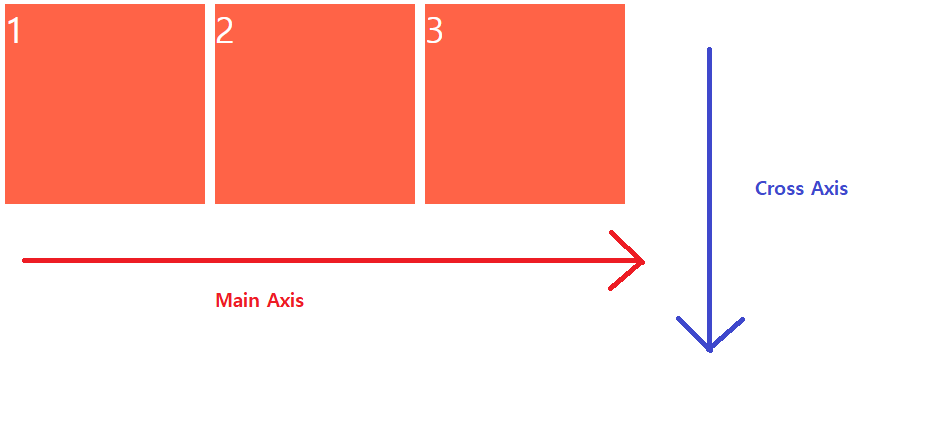
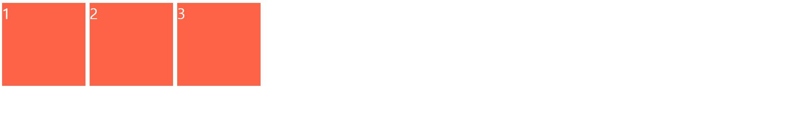
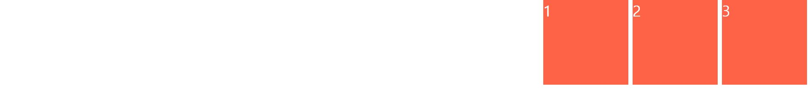
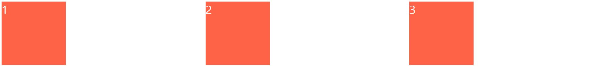
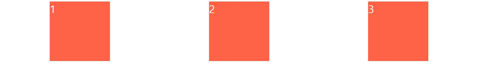
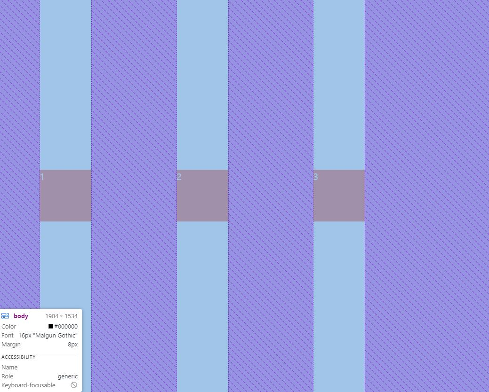
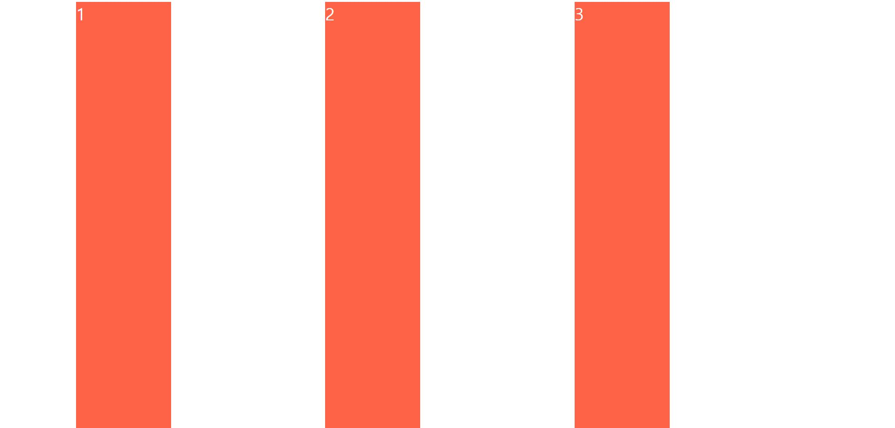
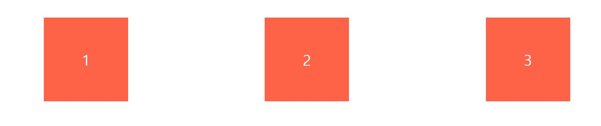

## Axis

```
Flex 레이아웃 시스템에는 두가지 축이 있음
한가지는 main axis(주축), 다른 하나는 cross axis(교차축) 임.

해당 축들의 위치는 flex container 의 direction 에 따라 달라진다.
```

<br>

#### flex-direction: row 가 기준일 경우



<br>

### justify-content?

```
주 축(main axis) 에서 아이템을 옮겨주는 프로퍼티
```

<br>

#### justify-content: center


주 축 기준으로 중앙 정렬 해주는 속성

<br>

#### justify-content: flex-start



주 축의 처음 부분 (지금같은 경우엔 왼쪽부터 시작) 에서 부터 시작하게 만들어주는 속성

<br>

#### justify-content: flex-end



주 축의 끝 부분으로 이동하게 해주는 속성

<br>

#### justify-content: space-between



각 요소들 사이에 일정한 공간을 두게 만듬

<br>

#### justify-content: space-around



각 요소의 주변에 일정한 공간을 두게 만듬

<br>

### align-items?

```
교차축(cross axis)를 기준으로 아이템을 옮겨주는 프로퍼티
위 예시들과 같은 속성이 있으며 교차축을 기준으로 해당 속성을 넣으면
교차축을 기준으로 아이템들의 위치를 움직일 수 있다.
```

ex) align-items: center



부모의 높이를 화면 전체 크기로 할당 한 후 align-items 속성을 center 로 두게 되면
위 사진처럼 교차축은 수직을 기준을 하므로 중앙에 정렬이 된다.

추가적으로 flex-start 는 화면 상단으로, flex-end 는 화면 하단으로 가는 모습을
볼 수 있다.

<br>



만약 박스가 넓이가 없을 경우 align-items: stretch 속성을 부여하여 해당 축의
처음부터 끝까지 넓이를 차지하게 할 수도 있다.

그럼 박스 안에 있는 숫자를 박스에 중앙으로 옮기게 하는 것도 flex 로 가능할까?
아래 코드처럼 작성하면 숫자를 중앙으로 옮길 수 있다.

```
.box {
  display: flex;
  justify-content: center;
  align-items: center
}
```



<br>
<br>

# Refer
* nomadcoders - CSS Layout 마스터클래스