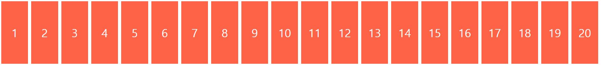
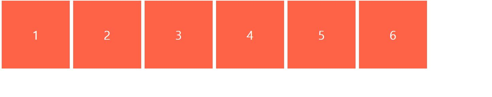
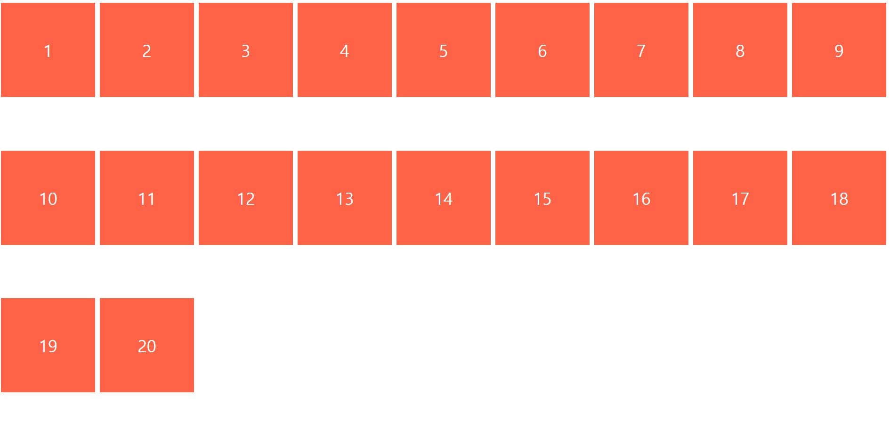
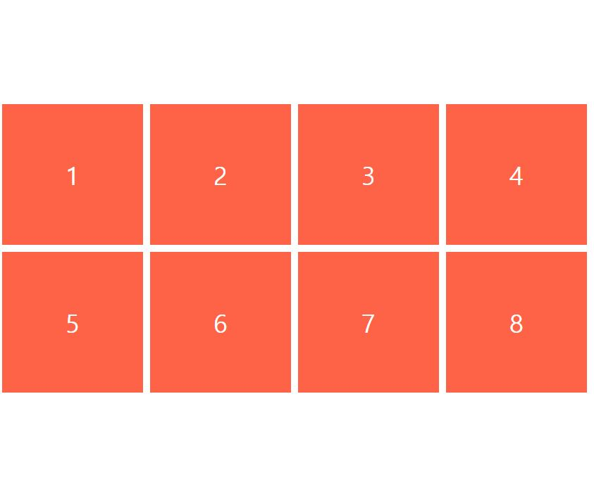
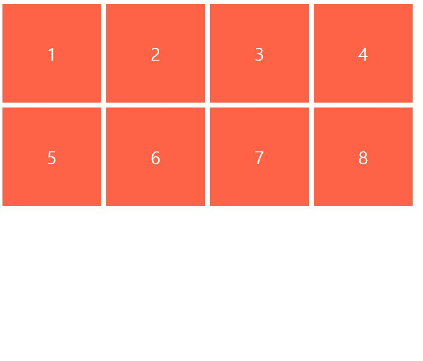
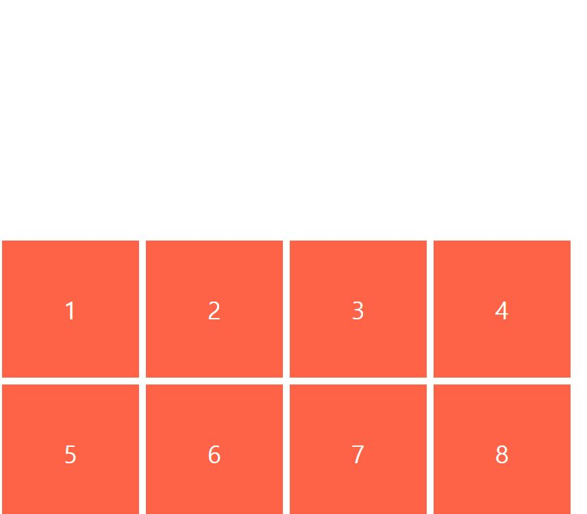
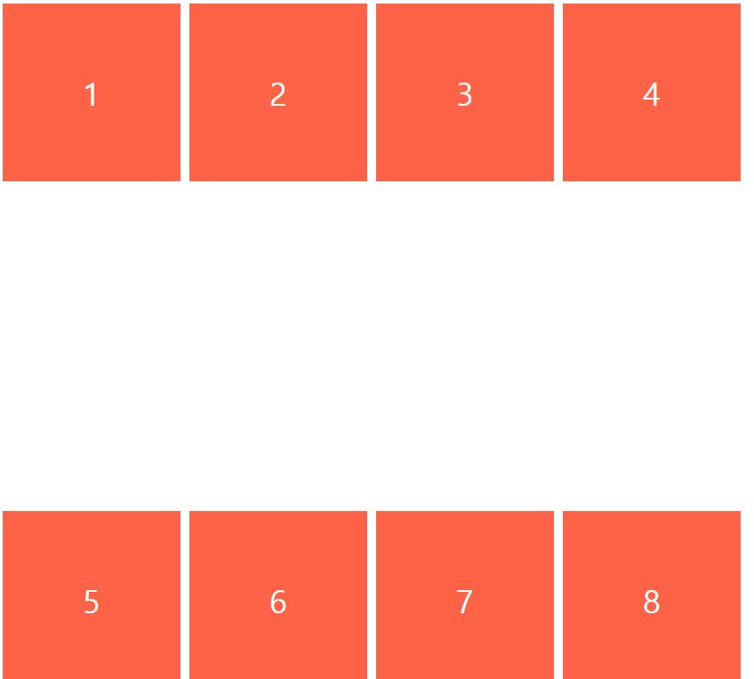
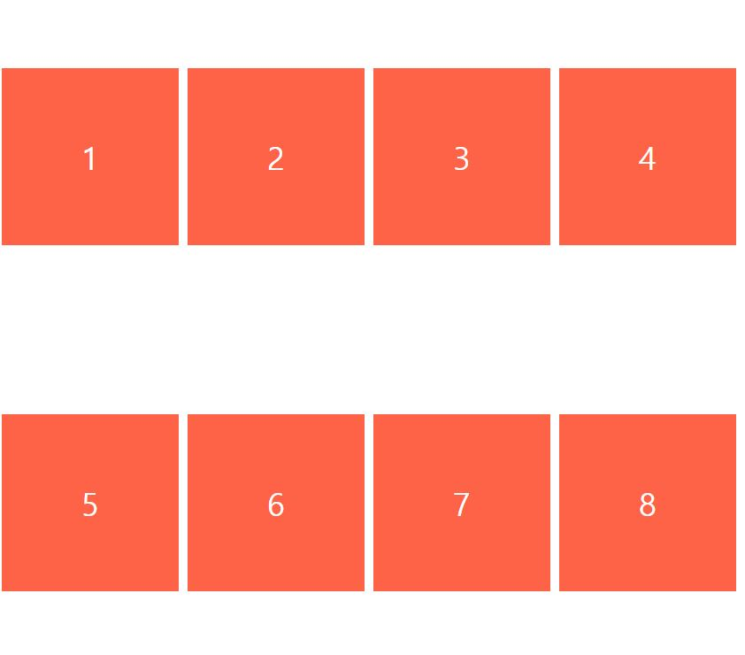
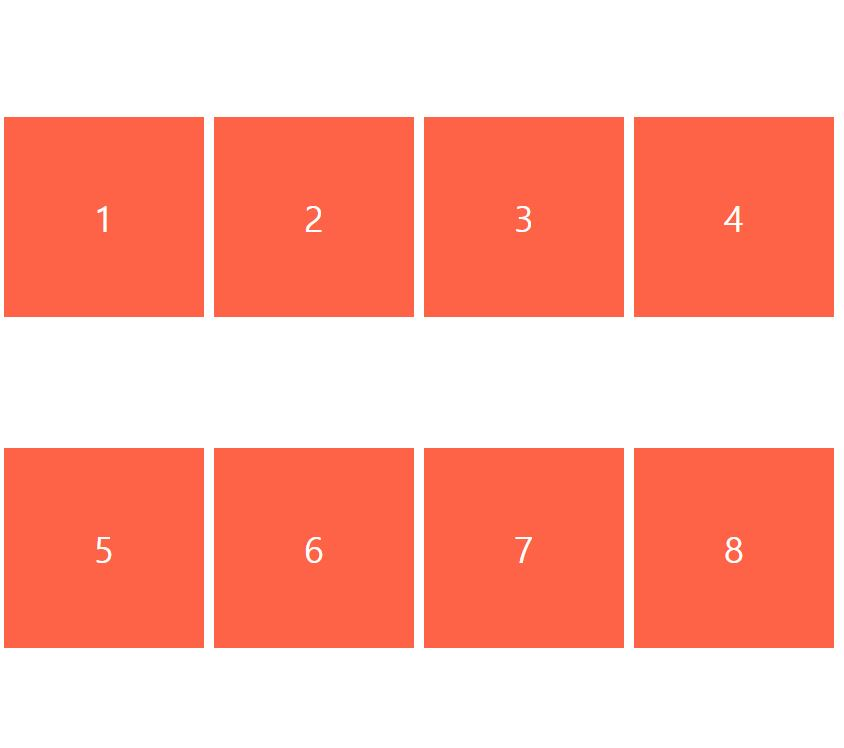
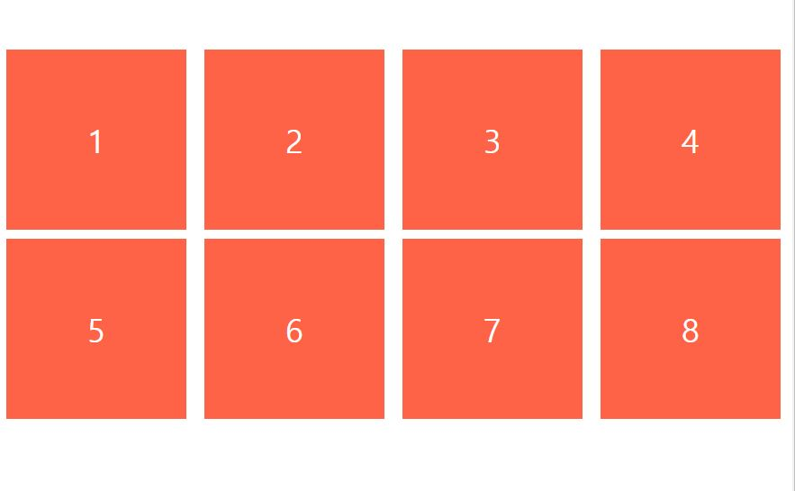

## flex-wrap

```
기본적으로 flexbox 는 flex 컨테이너 안의 항목들을
한 줄로 표시하려고 한다

아래 예시를 한번 확인해보자.
```

<br>

```
.box {
  width: 200px;
  height: 200px;
}
```

해당 박스가 각각 10개와 6개일때를 비교해 보자.





기본적으로 flexbox 는 컨테이너 안의 항목을 한줄로 표시하고

이에 따라 설정한 너비 속성이 무시되는 모습을 볼 수 있다.

이를 수정할 수 있는 속성이 flex-wrap 이다.

<br>

```
body {
  display: flex;
  flex-direction: row;
  flex-wrap: wrap;
}
```



flex-wrap 속성은 해당 flex 컨테이너가 다중라인 인지를 정하게 된다.

* flex-wrap: nowrap (기본값, 한 줄)
* flex-wrap: wrap (다중 라인)
* flex-wrap: wrap-reverse (다중 라인을 역순으로)

<br>

## flex-flow

* 단축 속성으로 하나의 속성을 통해 flex-direction, flex-wrap 을 설정함

```
body {
  display: flex;
  flex-direction: row;
  flex-wrap: wrap;
}

body {
  display: flex;
  flex-flow: row wrap;
} // 위 와 같이 한번에 속성을 설정할 수 있음
```

<br>

## align-content

* 다중 라인 flex 컨테이너 에서 라인의 정렬을 설정할 때 사용
* 다중 라인이 아닐 경우엔 동작하지 않음
* 교차 축을 가로지르는 방향에서 항목을 이동시킴

#### 1. align-content: center



<br>

#### 2. align-content: flex-start



<br>

#### 31. align-content: flex-end



<br>

#### 4. align-content: space-between



<br>

#### 5. align-content: space-around



<br>

#### 6. align-content: space-evenly



<br>

## column-gap / row-gap

* 다중 라인일때 행과 열의 갭을 따로 줄 수 있다.

```
body {
  display: flex;
  row-gap: 10px; // 수평
  column-gap: 20px; // 수직
}
```



<br>
<br>

# Refer
* nomadcoders - CSS Layout 마스터클래스

