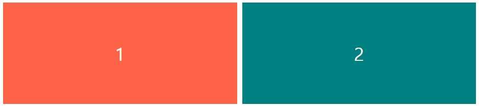
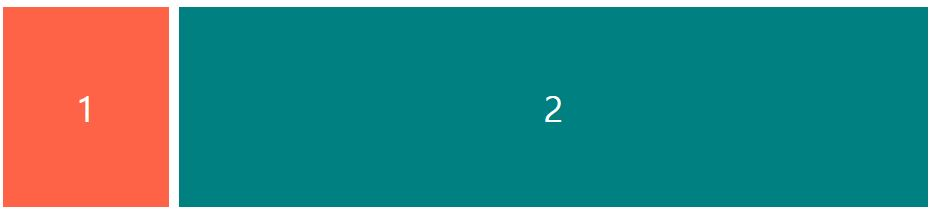
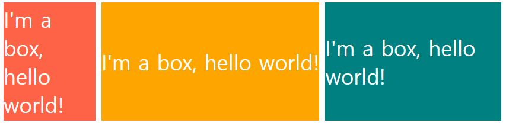

## Flex grow

+ flex 컨테이너 자식들에게 얼마만큼의 공간을 차지할 수 있는지 말해줌
+ px, 백분율이 아닌 비율만 사용 함, 따라서 픽셀이 아닌 비율로 생각할 수 있게 해줌
+ default 값은 0임

```
.box:first-child {
  background-color: tomato;
  flex-grow: 1;
}

.box:last-child {
  background-color: teal;
  flex-grow: 1;
}
```



+ 어떤 화면 크기던 동일한 grow 를 가지고 있기에 서로 같은 크기의 넓이를 최대한 가짐

<br>

```
.box:first-child {
  background-color: tomato;
  flex-grow: 1;
}

.box:last-child {
  background-color: teal;
  flex-grow: 5;
}
```




+ 이런식으로 코드를 작성하여 편하게 비율로 너비를 지정해 줄 수 있다.

<br>


## Flex shrink

+ 값이 클수록 화면을 수축할 때 얼마나 더 빨리 축소됨
+ 비율값 이므로 형제들과 상대적으로 줄어드는 것을 볼 수 있음
+ default 값은 1임
+ 0을 지정할 경우 내부 컨텐츠의 여백이 없어질때까지 줄어 드나 내부 컨텐츠 영역의 크기는 건들지 않는다.

```
.box:first-child {
  background-color: tomato;
  flex-grow: 1;
  flex-shrink: 3;
}

.box:nth-child(2) {
  background-color: orange;
  flex-grow: 2;
  flex-shrink: 0;
}

.box:last-child {
  background-color: teal;
  flex-grow: 1;
  flex-shrink: 1;
}
```



+ 레이아웃에서 먼저 축소되어야 하는 상자와 절대 축소되지 않아야 하는 상자를 지정할 떄 좋음

<br>
<br>

# Refer
* nomadcoders - CSS Layout 마스터클래스