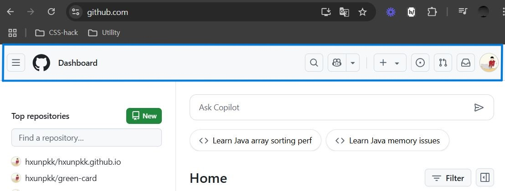
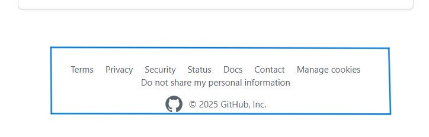
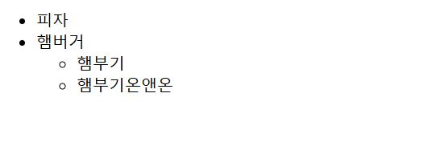
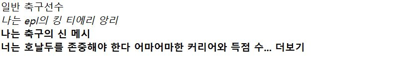

# Semantic Tag(시맨틱 태그)
+ 의미가 담긴 태그, 태그의 이름만으로도 그 역할을 알 수 있음.

```
<header> 페이지 상단
<footer> 페이지 하단
<h1> 페이지 제목
```

+ 반대로 의미가 담기지 않은 태그를 Non Semantic Tag(논 시맨틱 태그) 라고 불리움

```
<div>
<span>
```

<br>

## 시맨틱 태그를 사용해야 하는 이유?

### 검색 엔진 최적화 (SEO)
+ 검색시 상단에 노출될 수 있도록 검색 엔진을 최적화 하는데 도움이 됨.
검색 엔진이 태그의 내용을 확인하며 페이지 주제를 확인 할 수 있음.

### 웹 접근성
+ 스크린 리더가 웹 페이지를 스캔할 때 페이지 내용을 읽어 줄 때 제대로 작동하는 것 을 도와줌.

### 유지 보수성
+ 개발자들에게 유지 보수하기 편하도록, 코드를 읽기 편하도록 도와주는 효과가 있음.

## 구조 관련 시맨틱 태그

### header



+ 페이지의 상단 부분을 나타냄
+ 주로 로고나 다른 페이지로 이동할 수 있는 메뉴들을 담고있음

<br>

### footer



+ 페이지의 하단 부분을 나타냄
+ 주로 저작권 정보, 연락처, 메뉴등 부가적인 내용을 담음

<br>

### nav


+ 다른 페이지나 웹사이트로 이동할 수 있는 메뉴를 링크로 담고 주로 헤더나 푸터 안에 들어가 있는 경우가 많음

<br>

### main


+ 페이지의 주요 컨텐츠를 담아내는 영역
+ 사용자와 검색 엔진이 페이지의 주요 내용을 쉽게 파악하도록 돕는 역할을 함 그래서 보통 페이지당 한개를 사용하는 것을 권장함
+ 여러개를 사용해도 상관은 없지만 주요 컨텐츠의 내용이 모호해질 수 있음

<br>

### section


+ 연관된 내용을 하나의 주제로 묶어주는 태그
+ 혹시나 메인 태그 내에서 여러가지 주제 내용을 담는다면 섹션 태그로 주제별로 묶어주면 됨.

<br>

### article

+ 자체적으로 완전히 독립된  컨텐츠를 담으면 됨 ex) 신문 기사, 블로그 게시글
+ 아티클 안에서도 여러 주제를 다룬다면 이것 역시 섹션 태그로 해당 부분을 따로 묶어주어도 됨

<br>

### aside

+ 컨텐츠와 관련이 직접적으로 없는 부분을 담음 ex) 광고 배너

<br>

## 텍스트 관련 Semantic Tag

### h1


+ 페이지 제목을 알려주는 태그, 검색 엔진이 제목인지 파악할 수 있는 태그
+ 웹 사이트의 주제를 알 수 있으므로 명확하게 명시해 주는 것이 좋음
+ 한 사이트 내에서 여러개의 h1 태그 사용은 금물

<br>

### h2~h6


+ 페이지 내의 소제목들을 알려 주는 태그

<br>

### ol, ul, li 리스트

+ 목록을 나타내는 태그로 정보를 체계적으로 나타낼 때 쓰는 태그
+ ol 태그는 번호 순서가 있는 태그, ul 태그는 순서가 없는 태그를 만들어 줌.

<br>



```
<ul>
  <li>피자</li>
  <li>햄버거
    <ul>
      <li>햄부기</li>
      <li>햄부기온앤온</li>
    </ul>
  </li>
</ul>
```

### em, strong, b

+ em 태그는 텍스트를 강조할 때 쓰는 태그로 시각적으로 텍스트를 강조하며 스크린 리더기에서도 더 강조된 목소리로 해당 부분을 읽어 줌
+ strong 태그는 보다 더 강하게 강조할 때 사용 됨
시각적으로도, 스크린 리더기에서도 em 태그보다 더 강하게 읽어줌
+ b 태그는 시각적으로만 굵게 강조하고 그 이외에 다른 의미는 없음.



```
<span>일반 축구선수</span>
<em>나는 epl의 킹 티에리 앙리</em>
<strong>나는 축구의 신 메시</strong>
<b>너는 호날두를 존중해야 한다 어마어마한 커리어와 득점 수... 더보기</b>
```

<br>

## 논 시맨틱 태그? 왜 존재해야 할까

+ html에 맞는 시맨틱 태그가 없는 경우가 혹시라도 있는 경우 의미를 강제로 부여하기 보단 논 시맨틱 태그를 사용하는 것이 좋음
+ CSS 스타일링을 할 때 유용함. div 태그는 플렉스 박스등 컨테이너 구조를 만들 때, span 태그는 문장의 한 단어에 색 지정이라던지 유용하게 쓰일 수 있는 요소가 있음

<br>
<br>

# Refer
* Youtube 별코딩 - 프로 HTML러 들은 시맨틱 태그 쓴다 | Semantic Tags
[https://youtu.be/ibjT9DklAv8?si=EDpK2SQmqJ-BqXeq]
