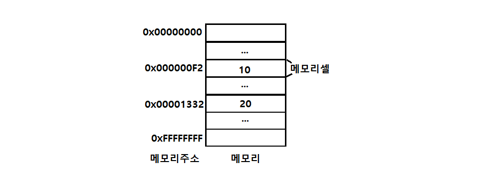

## 변수?

```
애플리케이션은 데이터를 다룬다
아무리 복잡한 애플리케이션도 결국 데이터를 입력받아 처리하고
그 데이터를 출력하는 것이 전부다

변수는 프로그래밍 언어에서 데이터를 관리하기 위한 핵심 개념이다
```

<br>

```
10 + 20
```
자바스크립트 엔진이 위 코드를 계산하려면 먼저 10, 20, + 라는 기호의 의미를 알아야 하며 10+20 이라는 식의 의미도 해석할 수 있어야 한다.

컴퓨터는 CPU를 사용해 연산하고 메모리를 사용해 데이터를 기억하며 메모리는 데이터를 저장할 수 있는 메모리 셀의 집합체다.

메모리 셀 하나의 크기는 1바이트(8비트) 이며 컴퓨터는 메모리 셀의 크기, 즉 1바이트 단위로 데이터를 저장, 읽기를 실행한다.



각 셀은 고유 메모리 주소를 갖으며 이는 메모리 공간의 위치를 나타낸다. 0부터 시작해 메모리 크기만큼의 정수로 표현된다.

예를 들어 4GB 메모리는 0부터 4,294,967,295(0x00000000~0xFFFFFFFF) 까지의 메모리 주소를 갖는다.

```
컴퓨터는 모든 데이터를 2진수로 처리한다.
따라서 데이터는 종류와 상관 없이 모두 2진수로 저장된다.
위 그림에 메모리에 저장된 값 역시 10, 20으로 표현했으나 실제로 저장될 땐 2진수로 저장된다.
```


위 그림처럼 연산은 끝났으나 CPU가 연산해서 만들어낸 숫자는 재사용 할 수 없다.

결과 값인 30에 접근하려면 메모리 주소를 통해 메모리 공간에 직접 접근해야 하나 이는 치명적 오류를 발생시킬 수 있는 매우 위험한 일이다.

따라서 자바스크립트는 개발자의 직접적인 메모리 제어를 허용하지 않는다.

만약 개발자의 직접적인 메모리 제어를 허용하더라도 값이 저장되는 메모리 주소는 코드가 실행될 때 마다 임의로 결정되어 변경되기 때문에 메모리 주소를 통해 값에 직접 접근하는 것은 올바른 방법이 아니다.

```
그러면 저 값은 어떻게 활용해야 하나요?
=> 변수를 활용하면 된다.
```

#### 변수란?
* 하나의 값을 저장하기 위해 필요한 메모리 공간 자체 또는 그 메모리 공간을 식별하기 위해 붙인 이름을 말함
* 즉, 값의 위치를 가리키는 상징적인 이름
* 변수는 컴파일러, 인터프리터에 의해 값이 저장된 메모리 공간의 주소로 치환되어 실행됨
* 개발자가 안전하게 값에 접근하도록 도와줌

<br>

```
var result = 10 + 20;
```


연산을 통해 생성된 값 30은 result 라는 변수에 할당되어 재사용 할 수 있도록 값이 저장되었다.

* 메모리 공간에 저장된 값을 식별할 수 있는 이름 -> 변수 이름
* 변수에 저장된 값 -> 변수 값
* 변수에 값을 저장하는 것 -> 할당
* 변수에 저장된 값을 읽어 들이는 것 -> 참조

```
코드는 컴퓨터에 내리는 명령이기도 하지만 개발자를 위한 
문서이기도 하다.

변수에 저장된 값의 의미를 파악할 수 있도록 좋은 변수
이름을 작명하는 것 역시 코드 가독성에 도움을 준다.
```

<br>

## 식별자

* 변수 이름을 식별자 라고도 함
* 어떤 값을 구별해서 식별할 수 있는 고유한 이름을 뜻함
* 식별자는 값이 아닌 메모리 주소를 기억한다
* 즉, 식별자는 메모리 주소에 붙인 이름이라고 할 수 있다

```
식별자는 변수 이름에 국한되지 않는다.
변수, 함수, 클래스 등의 이름은 모두 식별자다.
메모리 상에 존재하는 어떤 값을 식별할 수 있는 이름은 모두
식별자 라고 부른다.
```

변수, 함수, 클래스 등의 이름과 같은 식별자는 네이밍 규칙을 준수해야 하며, 선언에 의해 자바스크립트 엔진에 식별자의 존재를 알린다.


<br>

## 변수 선언

* 변수를 생성하는 것을 변수 선언이라고 함
* 메모리 공간을 확보하고 주소를 연결해 값을 저장할 수 있게 준비하는 것
* 변수 선언으로 확보된 공간은 해제 되기 전까지 누구도 공간을 사용할 수 없도록 보호되므로 안전하게 사용할 수 있다.

```
변수 선언의 키워드에는 var, let, const 가 있다.
ES6에서 let, const 도입 이전까지 var 이 유일한 키워드였으나
여러 단점들로 인해 새로운 키워드들의 도입이 이루어 졌다.
```

<br>

```
var score; // 변수 선언 (변수 선언문)
```


변수 선언 후 아무런 값도 할당하지 않으면 자바스크립트 엔진은 독특하게 undefined 값을 할당하여 초기화한다.

undefined 는 자바스크립트에서 제공하는 원시타입 값이다.

자바스크립트 엔진의 변수 선언은 다음과 같은 2단계에 걸쳐 수행이 이루어진다.

* 선언 단계: 변수 이름을 등록해 JS 엔진에 변수의 존재를 알림
* 초기화 단계: 값을 저장하기 위한 메모리 공간을 확보하고 undefined 를 할당해 초기화 한다.

```
변수 이름은 어디에 등록되나요?
모든 식별자는 실행 컨텍스트에 등록된다.

실행 컨텍스트는 JS 엔진이 소스코드를 평가하고 실행하기 위해 필요한 환경을 제공하고 코드의 실행 결과를 실제로 관리하는 영역이다.
이를 통해 식별자와 스코프를 관리한다.

변수 이름과 값은 실행 컨텍스트 내에 키/값 형식인 객체로 등록되어 관리된다.
```

초기화는 변수가 선언된 이후 최초로 값을 할당하는 것을 뜻하는데, 확보된 메모리 공간에 이전에 다른 애플리케이션이 사용했던 값(쓰레기 값)이 남아있을 수 있기 때문에 var 키워드의 이러한 암묵적인 초기화는 이런 위험에서 안전함을 가져다 준다.

<br>

## 변수 선언 실행 시점과 호이스팅

```
console.log(score);

var score;
```

기본적으로 코드는 줄의 순서대로 순차적으로 읽히기에 위 경우에 에러를 출력할 것 같지만 정상적으로 변수 score 의 값을 출력한다.

그 이유는 변수 선언이 소스코드가 한줄씩 순차적으로 실행되는 시점, 즉 런 타임이 아닌 그 이전 단계에서 먼저 실행되기 때문이다.

자바스크립트는 소스코드 실행 전 평가 과정을 거치면서 실행 준비를 하는데 이 때 변순 선언을 포함한 모든 선언문 (변수, 함수 선언문등) 을 소스코드에서 찾아 먼저 실행한다.

그 이후 선언문을 제외한 코드를 한줄씩 실행한다.

```
변수 선언문이 코드의 선두로 끌어 올려진 것 처럼 동작하는 자바스크립트 고유의 특징을 변수 호이스팅 이라고 한다. 
```

변수 뿐 아닌 var, let, const, function*, class 키워드를 사용해 선언하는 모든 식별자는 호이스팅 된다.

<br>

## 할당

* 변수에 값을 할당할 때는 할당 연산자 = 를 사용
* 우변의 값을 좌변의 변수에 할당함.

```
var score; // 선언
score = 80 // 할당

var score = 80; // 이런 식으로 단축표현 할 수도 있음
```

하지만 선언과 할당의 시점은 다르므로 주의해야 한다!

선언은 런타임 이전에 실행되지만 할당은 런타임에 실행되기 때문.

```
console.log(score) // undefined

var score = 80;

console.log(score) // 80
```

또한 값이 할당 할 때는 기존의 공간에 있던 값을 지우고 값을 새롭게 저장하는 것이 아닌 새로운 메모리 공간을 확보하고 그 곳에 할당 값을 저장한다는 점에 주의해야한다.


<br>

## 변수 재할당

```
var score = 80;
score = 90;
```

var 로 선언한 변수는 값의 재할당이 가능하다.

만약 변수에 값을 재할당 할 수 없다면 이는 변수가 아닌 상수라고 표현한다.

재할당 역시도 이전의 공간에 값을 지우는것이 아닌 새로운 공간을 확보하고 그 곳에 값을 할당하여 저장한다.


이전에 할당된 값들인 undefined 와 80은 가비지 콜렉터에 의해 메모리에서 자동 해제 되며 언제 해제될 지는 예측할 수 없다.

```
가비지 콜렉터?
애플리케이션이 할당한 메모리 공간을 주기적으로 검사해 사용되지
않는 메모리를 해제하는 기능을 의미한다.
이를 통해 자바스크립트는 메모리 누수를 방지한다.
```

<br>

## 식별자 네이밍 규칙

식별자는 다음과 같은 네이밍 규칙을 준수해야 한다.

* 특수문자를 제외한 문자, 숫자, 언더스코어(_), 달러 기호($) 를 포함할 수 있다.
* 단, 특수문자를 제외한 문자, 언더스코어(_), 달러 기호($) 로 시작해야 한다. 숫자로 시작하는 것은 허용되지 않는다.
* 예약어는 사용할 수 없다.

```
예약어는 프로그래밍 언어에서 사용되고 있거나 사용될 예정의
단어를 말한다. JS 에서 예약어는 다음과 같다.
```
|||||||
|-----|-----|----|----|-----|-----|
|await|break|case|catch|class|const|
|continue|debugger|default|delete|do|else|
|enum|export|extends|false|finally|for|
|function|if|implements *|import|in|instanceof|
|interface *|let *|new|null|package *|private *|
|protected *|publice *|return|super|static *|switch|
|this|throw|ture|try|typeof|var|
|void|while|with|yield *|||

(* 식별자로 사용 가능하나 strict mode 에서는 사용 불가)

<br>

변수 역시 위 네이밍 규칙을 따라야 한다. 또한 쉼표(,) 로 하나의 문에 여러 개를 선언 할 수 있으나 가독성이 나빠지므로 권장하지는 않는다. 

```
var person, $elem, _name, first_name, val1;
```

ES5 부터 유니코드 문자를 허용해 알파벳 외 한글, 일본어 식별자도 사용할 수 있지만 권장하지 않는다.

```
var 이름, あたい;
```

다음과 같은 경우는 규칙에 위배되어 사용할 수 없다.

```
var first-name; // SyntaxError: Unexpected token -
var 1st; // SyntaxError: Invalid or unexpected token
var this; // SyntaxError: Unexpected token this
```

자바스크립트는 대소문자를 구별하므로 다음 변수는 각각의 변수다.

```
var firstname;
var firstName;
var FIRSTNAME;
```

네이밍컨벤션은 식별자를 만들때 가독성 좋게 단어를 한눈에 구분하기 위해 규정한 명명 규칙이다. 다음과 같은 4가지 유형이 자주 사용된다.

```
// 카멜 케이스(camelCase)
var firstName;

// 스네이크 케이스(snake_case)
var first_name;

// 파스칼 케이스(PascalCase)
var FirstName;

// 헝가리언 케이스(typeHungarianCase)
var strFirstName; // type + identifier
var $elem = document.getElementById('myId') // DOM 노드
var observable$ = fromEvent(document, 'click') // RxJS 옵저버블
```

JS 에서는 일반적으로 변수 함수에는 카멜 케이스를

생성자 함수, 클래스에는 파스칼 케이스를 사용한다.

ECMAScript 에 정의된 객체와 함수들도 카멜 케이스와 파스칼 케이스를 사용하므로 이를 따르는 것이 코드 가독성에 유리하다.

<br>
<br>

# Refer

* 모던자바스크립트 Deep dive - 저자 이웅모
