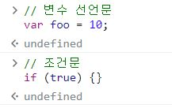

## 값
+ 값이란 식(표현식)이 평가되어 생성된 결과를 뜻함
+ 평가란 식을 해석해서 값을 생성하거나 참조하는 것을 뜻함
+ 모든 값은 데이터 타입을 가지며 메모리에 2진수, 즉 비트의 나열로 저장됨
+ 저장된 값은 데이터 타입에 따라 다르게 해석됨 
  - ex) 0100 0001 => 65(숫자 타입) or 'A'(문자 타입)

<br>

## 리터럴

* 리터럴은 사람이 이해할 수 있는 문자(아라비아 숫자, 알파벳, 한글 등), 약속된 기호('', "", [], {}, // 등)로 값을 생성하는 표기법을 뜻함
* 리터럴은 자바스크립트 엔진이 코드가 실행되는 시점인 런타임에 리터럴을 평가해 값을 생성한다.

```
3 // 숫자 리터럴 
위 3은 단순한 숫자가 아닌 숫자 리터럴 이라 볼 수 있다.
사람이 이해할 수 있는 숫자를 이용해 코드에 숫자 리터럴 3을
기술하면 자바스크립트 엔진은 이를 평하개 값 3을 생성한다.
```

### 리터럴의 종류

|리터럴|예시|비고|
|-----|-----|-----|
|정수|100||
|부동소수점|10.5||
|2진수|0b0100001|0b로 시작|
|8진수|0o101|ES6에서 도입, 0o로 시작|
|16진수|0x41|ES6에서 도입, 0x로 시작|
|문자열|'hello', "World"||
|불리언|true, false||
|null|null||
|undefined|undefined||
|객체|{name: 'Lee', address: 'Seoul'}||
|배열|[1, 2, 3]||
|함수|function(){}||
|정규 표현식|/[A-Z]+/g||

<br>

## 표현식

* 표현식은 값으로 평가될 수 있는 문을 뜻함
* 표현식이 평가되면 새로운 값을 생성하거나 기존 값을 참조함

```
1. var score = 100;
2. var score = 50 + 50;
3. score;
```
1. 위 예제 100은 리터럴임. 자바스크립트 엔진에 의해 평가되어 값을 생성하므로 리터럴은 그 자체로 표현식임

2. 50+50 은 리터럴과 연산자로 이뤄져 있음 그러나 이 역시 50+50이 평가되어 100을 생성하므로 표현식임.

3. 변수 식별자를 참조하면 변수값으로 평가됨. 이는 값을 생성하지는 않지만 값으로 평가되므로 표현식임.

이처럼 표현식은 리터럴, 식별자, 연산자, 함수 호출등의 조합으로 이뤄질 수 있음. 모두 값으로 평가된다는 점으로 동일하며 값으로 평가될수 있는 문은 모두 표현식임.

```
//리터럴 표현식
10
'Hello'

// 식별자 표현식(이미 선언했을 경우)
sum
person.name
arr[1]

// 연산자 표현식
10 + 20
sum = 10
sum !== 10

// 함수/메서드 호출 표현식
square()
person.getName()
```

표현식은 값으로 평가되며 표현식과 표현식이 평가된 값은 동등한 관계 동치임을 알 수 있다.

```
x = 1 + 2;
x + 3 // 6
```
위 식에서 x는 식별자 표현식이다. 그리고 x는 할당되어 있는 숫자 값 3으로 평가되므로 숫자가 들어가야 할 자리에 x를 사용하여 x + 3 = 6 이라는 결과를 만들어 낼 수 있다.

이처럼 표현식은 다른 표현식의 일부가 되어 값을 만들어 낼 수 있다.

<br>

## 문

+ 문은 프로그램을 구성하는 기본 단위이자 최소 실행 단위
+ 문의 집합으로 이뤄진 것이 바로 프로그램
+ 문을 작성하고 순서에 맞게 나열하는 것이 프로그래밍
+ 문은 여러 토큰으로 구성됨
  - 토큰이란 문법적으로 더 이상 나눌수 없는 코드의 기본 요소를 뜻함(키워드, 식별자, 연산자, 리터럴, 세미콜론, 마침표 등)

<br>

```
// 변수 선언문
var x;

// 할당문
x = 5;

// 함수 선언문
function foo() {}

// 조건문
if (x > 1) {}

// 반복문
for (var i = 0; i < 2; i++) {}
```
문은 명령문 이라고도 부르며 컴퓨터에 내리는 명령이다.

또한 문은 위처럼 선언문, 할당문, 조건문, 반복문 등으로 구분할 수 있다.

<br>

## 세미콜론
+ 세미콜론은 문의 종료를 나타냄 따라서 문을 끝낼 때에는 세미콜론을 붙여야 함
+ 단, 0개 이상의 문을 중괄호로 묶은 코드 블록({...}) 뒤에는 세미콜론을 붙이지 않음
  - ex) if문, for문, 함수 등 이들은 문의 종료를 의미하는 자체 종결성을 갖기 때문
+ 문의 끝에 붙이는 세미콜론은 옵션임(생략 가능) 이는 세미콜론 자동 삽입 기능(ASI)이 암묵적으로 수행되기 때문

아래 코드처럼 세미콜론 자동 삽입 기능을 제대로 예측하지 못해 이를 제대로 활용하지 못하는 경우도 있다.

```
function foo() {
    return
     {}
    // 개발자의 예측 => return {};
    // ASI의 동작 결과 => return; {};
}

console.log(foo()) // undefined
```

```
var bar = function () {}
(function() {})();
// 개발자의 예측 => var bar = function(){}; (function(){})();
// ASI 동작 결과 => var bar = function(){}(function(){})();
// TypeError: (intermediate value)(...) is not a function
```

세미콜론은 반드시 붙여야 한다는 주장과 붙이지 말아야 한다는 주장이 대립되지만 사용을 권장하는 분위기로 보는 것이 좋다.

<br>

## 표현식인 문과 아닌 문

```
// 변수 선언문은 값으로 평가될 수 없으므로 표현식이 아니다.
var x;

// 1, 2, 1 + 2, x = 1 + 2 모두 표현식이다
// x = 1 + 2 는 표현식이면서 완전한 문이기도 하다.
x = 1 + 2;
```

+ 표현식인 문은 값으로 평가될 수 있는 문이다.
  - ex) 할당문 등
+ 표현식이 아닌 문은 값으로 평가될 수 없는 문이다.
  - ex) 변수 선언문 등
+ 이를 구분하는 가장 명료한 방법은 변수에 할당해 보는 것이다.

```
// 표현식이 아닌 문은 값처럼 사용할 수 없다.
var foo = var x; // SyntaxError: Unexpected token var

// 할당문은 표현식이면서 완전한 문이다.
// 표현식인 문은 값처럼 사용할 수 있다
x = 100
var foo = x;
console.log(foo) // 100
```

#### 완료 값(completion value)

크롬 개발자 도구에서 표현식이 아닌 문을 실행하면 언제나 undefined를 출력한다. 이를 완료값 이라고 한다.

완료 값은 표현식의 평가 결과가 아니므로 다른 값과 같이 변수에 할당할 수 없고 참조할 수도 없다.



반대로 표현식인 문은 언제나 평가된 값을 반환한다.

<br>
<br>

# Refer

* 모던자바스크립트 Deep dive - 저자 이웅모


