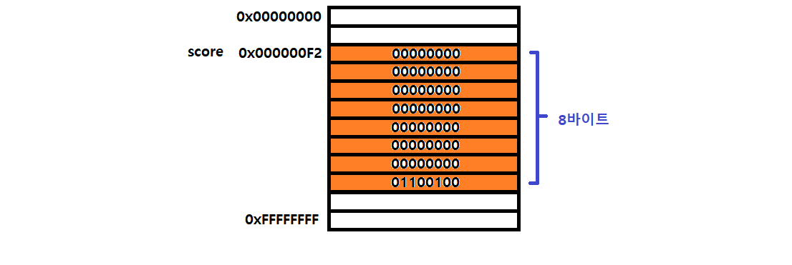

## 데이터 타입의 필요성

### 데이터 타입에 의한 메모리 공간의 확보와 참조

메모리에 값을 저장하려면 먼저 확보해야 할 메모리 공간의 크기를 결정해야 한다. 즉, 몇 바이트의 공간을 사용해야 낭비와 손실 없이 값을 저장할 수 있는지 알아야 한다.

```
var score = 100;
```

위 코드가 실행되면 100을 저장하기 위해 메모리 공간을 확보한 다음, 확보된 메모리에 숫자 100을 2진수로 저장한다.

이러할 처리를 하려면 숫자 값을 저장할 때 확보해야 할 메모리 공간의 크기를 알아야 하며, 자바스크립트 엔진은 값의 데이터 타입에 따라 정해진 크기의 메모리 공간을 확보한다.

즉, 할당되는 값의 데이터 타입에 따라 확보해야 할 메모리 공간의 크기가 결졍된다.



자바스크립트 엔진은 리터럴 100을 숫자 타입의 값으로 해석하고 숫자 타입의 값 100을 저장하기 위해 8바이트의 메모리 공간을 확보한다. 그리고 100을 2진수로 저장한다.

자바스크립트는 숫자 타입의 값을 생성할 때 배정밀도 64비트 부동소수점 형식을 사용한다. 따라서 실제로 메모리에 저장되는 값은 위 그림과 다르다. 지금은 간단히 양의 정수로 저장된다고 생각하자.

값을 참조하는 경우엔 식별자 score를 통해 숫자 타입의 값 100이 저장되어있는 메모리 공간의 주소를 찾아갈 수 있다.
정확히 말하자면 100이 저장되어 있는 메모리 공간의 선두 메모리 셀의 주소를 찾아갈 수 있다.

값을 참조하기 위해선 한번에 읽어들여야 할 메모리 공간의 크기, 바이트 수를 알아야 하는데 score 변수에는 숫자 타입의 값이 할당되어 있으므로 이를 숫자 타입으로 인식하고 8바이트 단위로 메모리 공간에 저장된 값을 읽어 들인다.

```
심벌 테이블
컴파일러 또는 인터프리터는 심벌 테이블 이라고 부르는 자료구조를 통해 식별자를 키로 바인딩 된 값의 메모리 주소, 데이터 타입, 스코프 등을 관리한다.
```

### 데이터 타입에 의한 값의 해석
그럼 메모리에서 읽어 들인 2진수를 어떻게 해석할까?

모든 값은 데이터 타입을 가지고, 2진수로 저장된다. 메모리에 저장된 값은 데이터 타입에 따라 다르게 해석되는데 위 예제의 경우엔 score 변수를 참조하면 메모리 공간의 주소에서 읽어 들인 2진수를 숫자로 해석한다.

### 데이터 타입이 필요한 이유
+ 값을 저장할 때 확보해야 하는 메모리 공간의 크기를 결정하기 위해
+ 값을 참조할 때 한번에 읽어 들여야 할 메모리 공간의 크기를 결정하기 위해
+ 메모리에서 읽어 들인 2진수를 어떻게 해석할지 결정하기 위해

<br>

## 동적 타이핑

### 동적 타입의 언어와 정적 타입 언어

+ C나 자바같은 정적 타입의 언어는 변수를 선언할 때 변수에 할당할 수 있는 값의 종류, 데이터 타입을 사전에 선언해야 함 이를 명시적 선언이라고 한다.

```
char c // c 변수에서는 1바이트 정수 타입의 값만 할당할 수 있다.

int num // num 변수에는 4바이트 정수 타입의 값만 할당할 수 있다.
```

+ 정적 타입 언어는 변수 타입을 변경할 수 없고 해당 타입에 맞는 값만 할당할 수 있다.
+ 정적 타입 언어는 컴파일 시점에 타입 체크를 수행하고 이를 통과하지 못하면 에러를 발생시키고 프로그램 실행 자체를 막는다.
+ 이를 통해 타입의 일관성을 강제해 안정적인 코드 구현, 런타임에 발생하는 에러를 줄인다.
+ 대표적으로 C, C++, 자바, 코틀린, 고, 하스켈, 러스트, 스칼라 등이 정적 타입 언어이다.

<br>

자바 스크립트는 정적타입 언어와 다르게 변수 선언시 타입을 선언하지 않는다. 다만 var, let, const 키워드를 통해 변수를 선언할 뿐이다. 그리고 어떠한 데이터 타입의 값이라도 자유롭게 할당할 수 있다.

```
var foo;
console.log(typeof foo); // undefined

foo = 3;
console.log(typeof foo); // number

foo = 'Hello';
console.log(typeop foo); // string

foo = true;
console.log(typeop foo); // boolean

foo = null;
console.log(typeop foo); // object

foo = Symbol();
console.log(typeop foo); // symbol

foo = {};
console.log(typeop foo); // object

foo = [];
console.log(typeop foo); // object

foo = function(){};
console.log(typeop foo); // function
```

정적 타입 언어는 변수 선언 시점에 변수 타입이 결정되고 이를 변경할수 없으나 자바스크립트는 이가 동적으로 결정되고 언제든지 자유롭게 변경할 수 있다.

즉, 자바스크립트는 선언이 아닌 할당에 의해 변수의 타입이 결정(타입 추론)된다. 그리고 재할당에 의해 언제든지 동적으로 이는 변할 수 있다.

이러한 특징을 동적 타이핑 이라 하며 자바스크립트를 동적 타입 언어라고 한다.

대표적인 동적 타입 언어로는 자바스크립트, 파이썬, PHP, 루비, 리스프, 펄 등이 있다.

<br>

### 동적 타입 언어와 변수

모든 소프트웨어 아키텍처에는 트레이드오프가 존재하며 이렇게 편리함의 이면에는 단점 역시도 존재한다.

+ 변수 값이 언제든지 변경될 수 있어 복잡한 프로그램에서는 변화하는 변수 값을 추적하기 어려울 수 있다.
+ 이는 개발자의 의도와는 상관 없이 엔진에 의해 암묵적으로 타입이 자동으로 변환될 수도 있음을 뜻한다.
+ 즉, 동적 타입 언어는 유연성은 높지만 신뢰성이 떨어진다.

### 동적 타입 언어 변수를 사용할 때 주의 사항

+ 변수는 꼭 필요한 경우에 제한적으로 사용한다. 자바스크립트는 타입을 잘못 예측해 오류가 발생할 가능성이 크며 개수가 많을수록 오류의 확률도 높아진다.

+ 변수의 유효 범위(스코프)는 최대한 좁게 만들어 변수의 부작용을 억제해야 한다.

+ 전역 변수는 최대한 사용하지 않도록 한다. 어디서든 참조/변경이 가능한 전역 변수는 의도치 않게 값이 변경될 가능성이 높고 다른 코드에 영향을 줄 가능성이 높다.

+ 변수보다는 상수를 사용해 값의 변경을 억제한다.

+ 변수 이름은 목적이나 의미를 파악할 수 있도록 네이밍 한다. 변수 뿐 아니라 모든 식별자는 존재 이유를 파악할 수 있는 네이밍을 하여 코드를 이해하기 쉽게 만들고 협업과 생산성 향상에 도움을 주어야 한다.

<br>

코드는 오해하지 않도록 작성하며 동작뿐만 아니라 개발자들, 사람이 이해할 수 있는 가독성이 좋은 코드가 좋은 코드이다.

<br>
<br>

# Refer

* 모던자바스크립트 Deep dive - 저자 이웅모